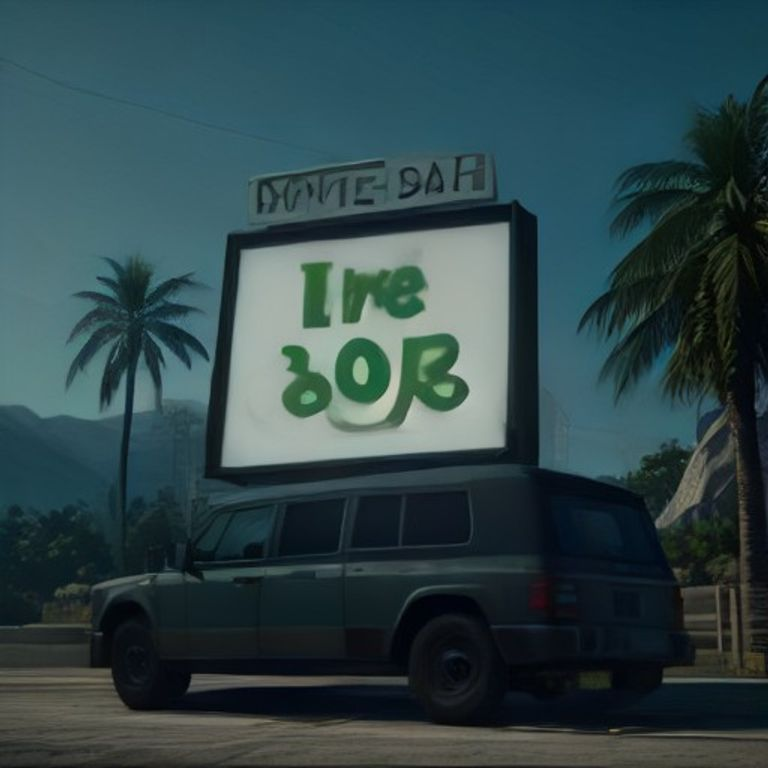

[

> **Nota:** Esta es una imagen de demostración del cartel de cultivo. Para más información sobre configuración y uso, ver la sección 'Uso' a continuación.
# FiveM-Carteles - Sistema de Carteles Interactivos

## Descripción
FiveM-Carteles es un sistema de carteles interactivos para FiveM que permite a los jugadores participar en actividades ilegales como cultivo, procesamiento y venta de drogas dentro del servidor.

## Características

### 🌱 Sistema de Cultivo
- Cultiva marihuana en ubicaciones específicas
- Requiere semillas para iniciar
- Tiempo de cultivo: 30 segundos
- Animaciones realistas de cultivo

### 🔬 Sistema de Procesamiento
- Procesa marihuana cultivada en droga pura
- Requiere marihuana cultivada como material
- Tiempo de procesamiento: 20 segundos
- Animaciones de laboratorio

### 💰 Sistema de Venta
- Venta de droga procesada a NPC o jugadores
- Requiere droga procesada
- Tiempo de venta: 15 segundos
- Animaciones de transacción

### 🛡️ Anti-Cheat
- Sistema de detección de actividades sospechosas
- Monitoreo de tiempos de interacción
- Registro de acciones para revisión de administradores

### 🔔 Discord Webhook
- Notificaciones automáticas en Discord
- Alertas de actividad en carteles
- Registros de transacciones importantes

## Requisitos
- **oxmysql** - Para manejo de base de datos
- **ox_lib** - Para UI y componentes
- **ox_target** - Para zonas de interacción
- **Framework**: ESX o QBCore

## Instalación
1. Copia la carpeta `FiveM-Carteles` a tu directorio de recursos de FiveM
2. Asegúrate de tener los requisitos instalados
3. Ejecuta el archivo SQL en tu base de datos
4. Agrega `ensure FiveM-Carteles` a tu `server.cfg`

## Configuración
Edita `config.lua` para personalizar:
- Framework (ESX o QBCore)
- Idioma (en, es, it)
- Posiciones de carteles
- Tiempos de interacción
- Webhook de Discord

## Uso

### Como Administrador
1. Coloca los carteles en las ubicaciones deseadas
2. Configura los permisos de job si es necesario
3. Monitorea la actividad a través del Discord webhook

### Como Jugador
1. Acércate a un cartel interactivo
2. Presiona la tecla de interacción
3. Sigue las instrucciones en pantalla
4. Completa la actividad con éxito

## Monetización
Este recurso está disponible para venta en Tebex:
- Precio: $25 USD
- Incluye soporte por 30 días
- Actualizaciones gratuitas por 3 meses
- Personalización básica incluida

## Contacto
Para soporte o consultas:
- Email: emilio@ranuk.dev
- Discord: Ranuk IT Solutions

## Licencia
© 2026 Ranuk IT Solutions. Todos los derechos reservados.
